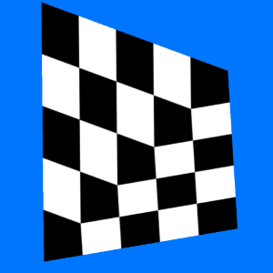
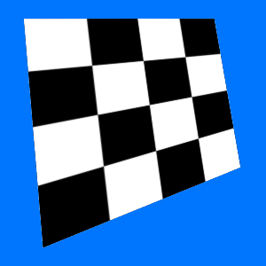
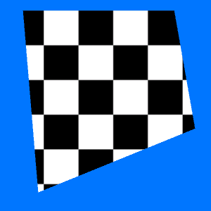

# Unity Skew Quad

A simple Unity package that enables creation of a skewed quad in Unity without a affine texture mapping.

Based on [Bitlush's work in OpenGL ES 2.0](https://github.com/bitlush/android-arbitrary-quadrilaterals-in-opengl-es-2-0)

## Setup

Load up the Demo scene to see how to set it up. The orthographic camera was simply a personal preference and is not necessary. 

Currently the SkewDemo calls UpdateMeshAndTexture in the Update loop but this is just for easy testing.

## Output

Affine Texture Mapping

Skewed Texture Mapping

Clipped Texture Mapping

